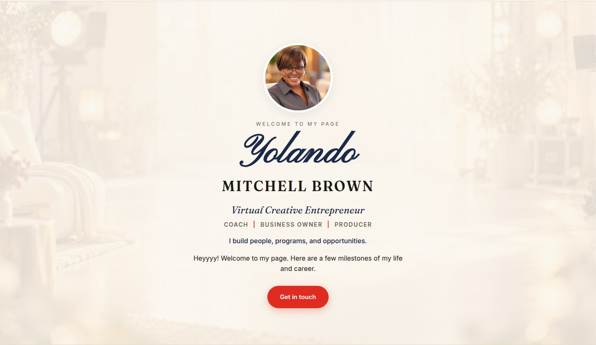
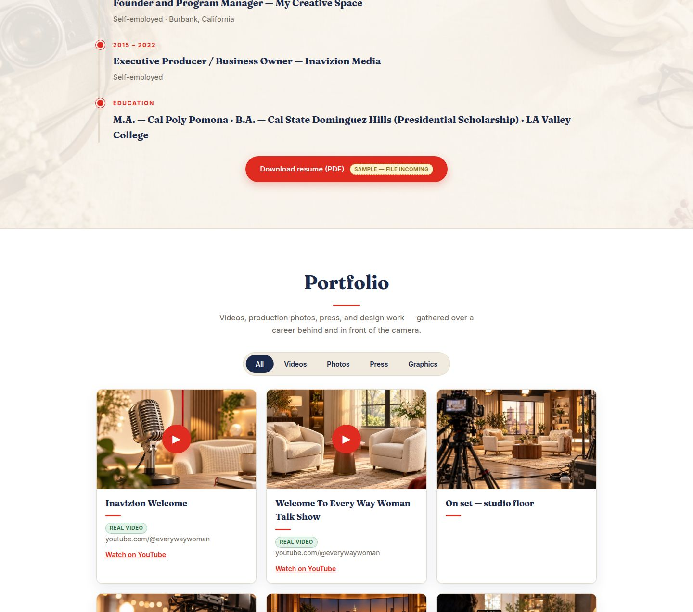
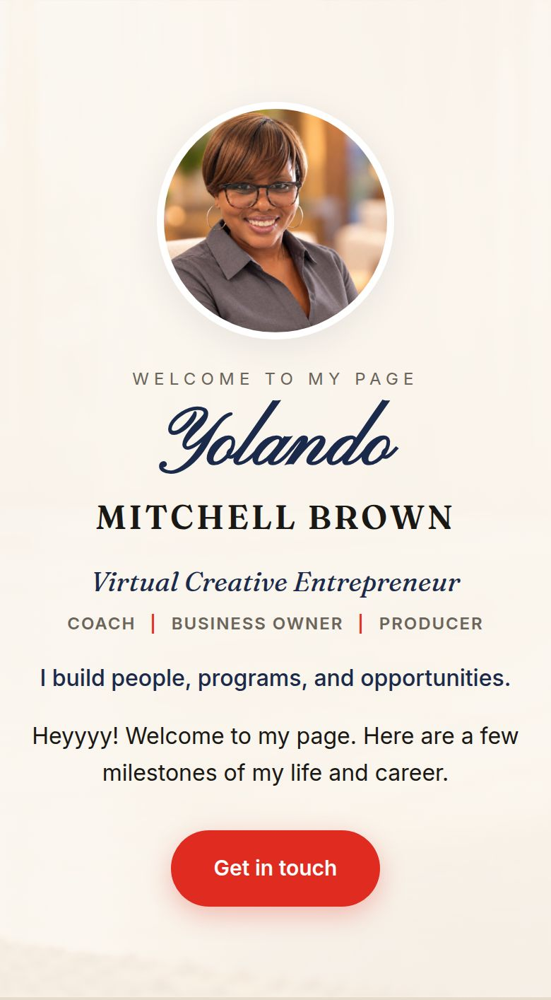

# YolandoMitchellBrown-Remake

**Branch policy:** work happens on the latest `*-vN` / project branch. List branches before editing. Never assume the GitHub default is the working line. Working line: `yolando-personal-v1` (GitHub default is `main`).

> A warm, editorial one-page remake of [yolandomitchellbrown.com](https://yolandomitchellbrown.com/) — Yolando Mitchell Brown's personal site. Soft ivory register, "I build people, programs, and opportunities."

[](https://inavizionmedia.github.io/YolandoMitchellBrown-Remake/)
[](https://inavizionmedia.github.io/YolandoMitchellBrown-Remake/)
[](https://github.com/InavizionMedia/YolandoMitchellBrown-Remake/commits/main)
[](https://github.com/InavizionMedia/YolandoMitchellBrown-Remake)
[](https://inavizionmedia.github.io/YolandoMitchellBrown-Remake/)

## Live preview

**https://inavizionmedia.github.io/YolandoMitchellBrown-Remake/**

## Hero



*Hero is shown in the site's real light register — this build is intentionally light/warm per the client's direction ("soft colors, but professional"), so there is no dark-mode variant.*

## What's inside

- **Hero** — circular portrait, script wordmark, one CTA, washed studio-glow parallax backdrop
- **About** — full-width bio ("Student of Life"), pull quotes, six "hats" cards
- **Resume** — semantic timeline from her LinkedIn experience, washed desk flat-lay backdrop
- **Portfolio** — filterable grid (videos / photos / press / graphics) with click-to-load video facades and a native `<dialog>` theater lightbox
- **Services** — three named offer cards with "who it's for" lines
- **Testimonials** — static quote cards + "As seen in" proof strip
- **Contact** — `mailto` + optional Calendly placeholder, 48-hour reply note, washed conversation-set backdrop

## Design language

Warm ivory paper, near-black ink, editorial serif (Fraunces) + clean sans (Inter), Pinyon Script for the "Yolando" wordmark only, one restrained red accent. Hairline borders + soft layered shadows on cards (no flat color top-bands). Soft motion with `prefers-reduced-motion` respected.

## Tech stack

| Layer   | Choice                                                              |
| ------- | ------------------------------------------------------------------- |
| Markup  | Single `index.html`, semantic HTML5                                   |
| Styling | Hand-written `style.css`, no frameworks                             |
| Script  | Vanilla JS (`script.js`): filter, dialog lightbox, mobile menu       |
| Media   | Optimized JPGs in `assets/`, lazy-loaded; SVG favicon                |
| Hosting | GitHub Pages from `main`, `.nojekyll`                                |

## Project structure

```
├── index.html          # the whole page
├── style.css           # design system + sections
├── script.js           # filter, lightbox, menu, motion
├── favicon.svg
├── .nojekyll
├── assets/             # portraits, portfolio images, video thumbs, bg washes, og-image
├── media/              # README screenshots (hero, portfolio, mobile)
└── docs/
    ├── REMAKE-BRIEF-V1.md
    ├── REMAKE-BRIEF-V2.md
    ├── STATUS-2026-10-06.md
    └── EDITING-GUIDE.md   # how Yolando updates the site herself
```

## Screenshots

**Portfolio grid** — filter pills, custom video thumbnails, warm card register:



**Mobile** — hero at 390px:



Screenshots are refreshed on every build change — no stale screenshots.

## Status

Preview build. Real content is live where gathered (LinkedIn experience, portrait, three Inavizion Media videos); clearly-tagged stand-ins remain for resume PDF, contact email, testimonials, and portfolio assets until Yolando sends hers. See `docs/EDITING-GUIDE.md` for the swap list.
